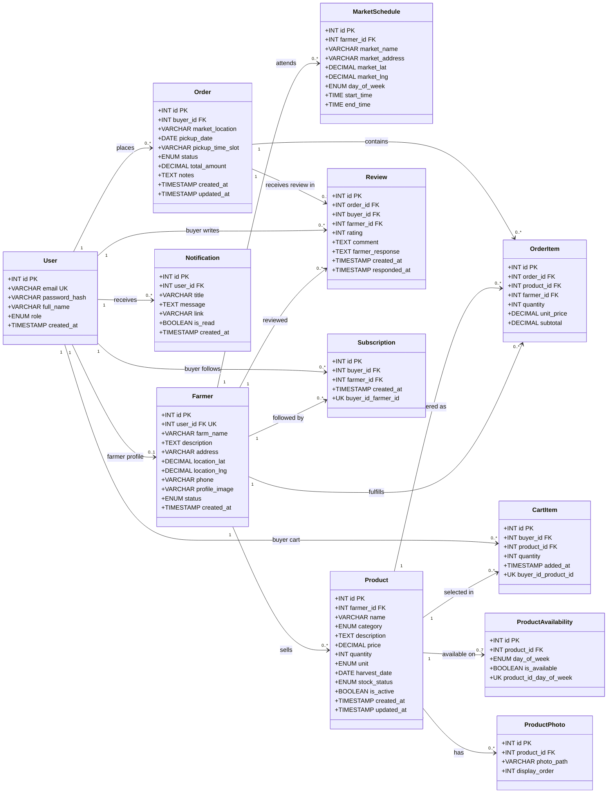
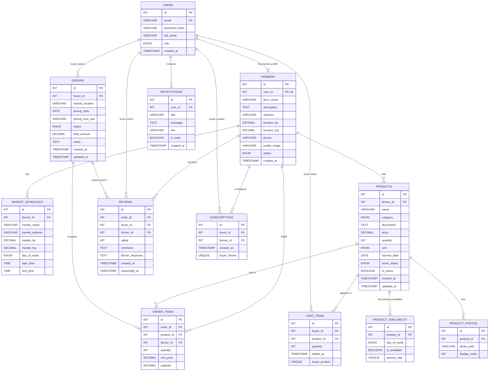

# Database Models

Source schema: [`schema.sql`](./schema.sql)

## UML Class Diagram

## Relational Model

## Notes

- `users.role` distinguishes buyers, farmers, and admins; a farmer also has one optional `farmers` profile linked through the unique `farmers.user_id`.
- `cart_items` and `subscriptions` are associative tables with uniqueness constraints to prevent duplicate product entries per buyer and duplicate follows per buyer/farmer pair.
- `order_items` stores both `product_id` and `farmer_id`, which snapshots who fulfills each item even though the product already belongs to a farmer.
- All foreign keys use `ON DELETE CASCADE`, so deleting a parent row removes dependent records.
